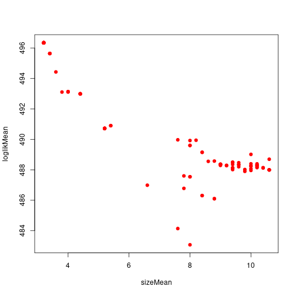
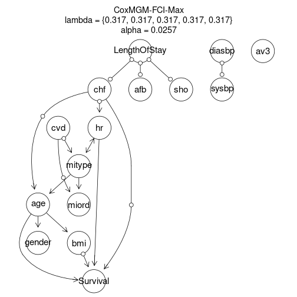

# CausalCoxMGM
Implementation of CausalCoxMGM algorithm and scripts for analysis of simulated and real-world biomedical datasets.

## Installation

To install CoxMGM and CausalCoxMGM, run the following command in the terminal:

```
R CMD INSTALL rCausalMGM
```

or alternatively:

```
R CMD INSTALL rCausalMGM/rCausalMGM_1.0.tar.gz
```

## Demonstration of CausalCoxMGM with the WHAS500 dataset


First, we begin by loading the necessray R packages for this analysis.


``` r
library(rCausalMGM)
library(survival)
library(dplyr)
library(survminer)
library(ggplot2)
```

Next, we load the WHAS500 dataset and format the data appropriately for analysis by CausalCoxMGM. First, we create our censored variables, Survival and LengthOfStay, using the `Surv` function from the `survival` R package. Then, we exclude features that are not clinical measurements or patient outcomes, and convert discrete variables into factors.


``` r
data <- read.csv('cvd/whas500.csv', row.names=1)

data$LengthOfStay <- Surv(data$los, 1-data$dstat)

data$Survival <- Surv(data$lenfol, data$fstat)

data <- data %>% select(-c("admitdate", "disdate", "fdate", "dstat", "lenfol", "fstat", "year", "los"))

data <- data %>% mutate_at(c("cvd", "afb", "sho", "chf", "av3", "gender", "miord", "mitype"), factor)

head(data)
```

```
##   age gender hr sysbp diasbp      bmi cvd afb sho chf av3 miord mitype
## 1  83      0 89   152     78 25.54051   1   1   0   0   0     1      0
## 2  49      0 84   120     60 24.02398   1   0   0   0   0     0      1
## 3  70      1 83   147     88 22.14290   0   0   0   0   0     0      1
## 4  70      0 65   123     76 26.63187   1   0   0   1   0     0      1
## 5  70      0 63   135     85 24.41255   1   0   0   0   0     0      1
## 6  70      0 76    83     54 23.24236   1   0   0   0   1     0      0
##   LengthOfStay Survival
## 1            5    2178+
## 2            5    2172+
## 3            5    2190+
## 4           10      297
## 5            6    2131+
## 6           1+        1
```

Next, we perform stratified 5-fold cross-validation to select model hyperparameters. Cross-validation folds are stratified to have approximately the same number of all-cause mortality and hospital discharge events. We measure model performance based on the total deviance of the censored outcomes. Rather than performing a grid search over the hyperparameters, we perform a random search.


``` r
set.seed(43)

idx00 <- which(data$Survival[,2]==0 & data$LengthOfStay[,2]==0)
idx10 <- which(data$Survival[,2]==1 & data$LengthOfStay[,2]==0)
idx01 <- which(data$Survival[,2]==0 & data$LengthOfStay[,2]==1)
idx11 <- which(data$Survival[,2]==1 & data$LengthOfStay[,2]==1)

foldid <- rep(0, 500)
foldid[idx00] <- sample(((1:length(idx00))-1) %% 5 + 1)
foldid[idx10] <- sample(((1:length(idx10))-1) %% 5 + 1)
foldid[idx01] <- sample(((1:length(idx01))-1) %% 5 + 1)
foldid[idx11] <- sample(((1:length(idx11))-1) %% 5 + 1)

table(foldid, data$Survival[,2])
```

```
##       
## foldid  0  1
##      1 57 44
##      2 57 43
##      3 57 43
##      4 57 43
##      5 57 42
```

``` r
table(foldid, data$LengthOfStay[,2])
```

```
##       
## foldid  0  1
##      1  8 93
##      2  8 92
##      3  8 92
##      4  8 92
##      5  7 92
```

``` r
lambdas <- runif(100, 0.05, 0.5)

alphas <- runif(100, 0.01, 0.25)

loglik <- matrix(0, 100, 5)
size <- matrix(0, 100, 5)
for (k in 1:5) {
    ig.path <- coxmgmPath(data[foldid!=k,], lambdas=lambdas, rank=F)
    idx <- 0
    for (ig in ig.path$graphs) {
        idx <- idx + 1
        g <- fciStable(data[foldid!=k,], initialGraph=ig,
                       alpha=alphas[idx], orientRule="maxp", rank=F)
        mb <- g$markov.blankets$Survival
        size[idx,k] <- length(mb)
        if (length(mb)==1) {
            mb <- c(1)
        }
        f <- as.formula(paste("Survival ~", paste(mb, collapse=" + ")))
        res <- coxph(f, data[foldid!=k,])
        test.risk <- predict(res, newdata=data[foldid==k,])
        res.test <- coxph(Survival ~ offset(test.risk), data[foldid==k,])
        loglik[idx,k] <- -as.numeric(logLik(res.test))

        mb <- g$markov.blankets$LengthOfStay
        size[idx,k] <- size[idx,k] + length(mb)
        if (length(mb)==1) {
            mb <- c(1)
        }
        f <- as.formula(paste("LengthOfStay ~", paste(mb, collapse=" + ")))
        res <- coxph(f, data[foldid!=k,])
        test.risk <- predict(res, newdata=data[foldid==k,])
        res.test <- coxph(LengthOfStay ~ offset(test.risk), data[foldid==k,])
        loglik[idx,k] <- loglik[idx,k] + -as.numeric(logLik(res.test))
    }
}

sizeMean <- rowMeans(size)
loglikMean <- rowMeans(loglik)
loglikSd <- apply(loglik, 1, sd)

plot(sizeMean, loglikMean, pch=19, col='red')
```



``` r
minIdx <- which.min(loglikMean)
```

Now that we have selected the best set of hyperparameters, we learn the final causal graphical model of all-cause mortality and hospital discharge after hospitilazation with acute myocardial infarction. This is done in two stages: first, we learn the undirected CoxMGM that serves as an initial estimate of the adjacencies in the causal graph. Second, we use FCI-Max to prune adjacencies and orient edges.


``` r
ig.path <- coxmgmPath(data, lambda=lambdas)

g <- fciStable(data, initialGraph=ig.path$graphs[[minIdx]],
               alpha=alphas[minIdx], verbose=T, orientRule="maxp")
```

```
## Starting FCI-Stable algorithm...
##   Starting FAS Stable...
##     Searching at depth 0...
##     Searching at depth 1...
##     Searching at depth 2...
##     Searching at depth 3...
##     Searching at depth 4...
##   FAS Stable Elapsed Time =  0.029 s
##   RFCI adjacency pruning...
##   Starting Posssible DSep search
##     Starting Conservative Orientations...
##       Filling Triple Map...
##     Orienting colliders...
##     Checking Possible-Dsep sets...
##   Starting Final Orientations...
##     Filling Triple Map...
##   Orienting colliders...
##   Orienting implied edges...
##   FCI-Stable Elapsed Time =  0.25 s
```

``` r
g
```

```
## Algorithm:  CoxMGM-FCI-Max 
## Nodes:  15 
## Edges:  17 
##   Unoriented:  4 
##   Partially Oriented:  6 
##   Directed:  6 
##   Bidirected:  1 
## lambda = {0.3173977, 0.3173977, 0.3173977, 0.3173977, 0.3173977}
## alpha =  0.02566852
```

Finally, we can generate a simple plot of the causal graphical model in R.


``` r
plot(g, nodeAttr=list(fontsize=36))
```


